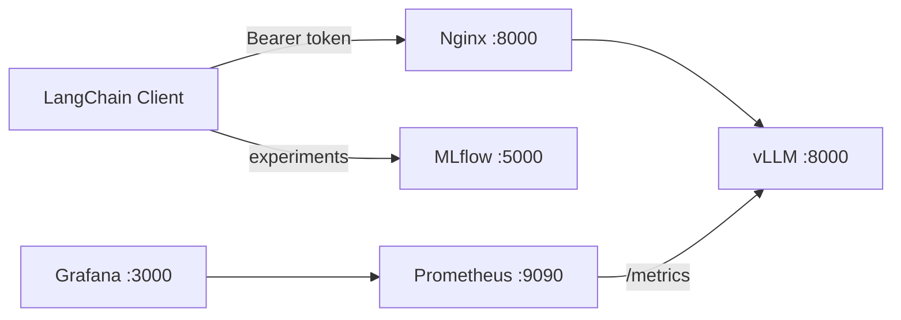

# LLMOps Stack

Production-ready LLM inference and monitoring stack with Docker Compose. Deploys **vLLM** behind an authenticated **Nginx** proxy, with **Prometheus/Grafana** metrics and **MLflow** experiment tracking.

Runs on **CPU**, **NVIDIA GPU**, or **AMD ROCm** via compose override files. Default model: [Qwen/Qwen2.5-0.5B](https://huggingface.co/Qwen/Qwen2.5-0.5B) (cached across restarts).

## Overview

- **Inference** — vLLM serves any Hugging Face model via an OpenAI-compatible API
- **Security** — Nginx enforces Bearer token auth; vLLM is not exposed on the host
- **Monitoring** — Prometheus scrapes vLLM `/metrics`; Grafana ships with a pre-built dashboard
- **Observability** — MLflow logs prompts, responses, and latency
- **Client** — LangChain test script validates the full stack end to end



**Service documentation:** [docs/](docs/README.md) (Nginx, Prometheus, Grafana, deployment)

## Project layout

```
LLMOps-Stack/
├── docker-compose.yml          # Base stack (shared services)
├── docker-compose.gpu.yml      # NVIDIA GPU overrides
├── docker-compose.cpu.yml      # CPU overrides
├── docker-compose.rocm.yml     # AMD ROCm overrides
├── .env.example                # Environment template
├── config/
│   ├── nginx.conf
│   ├── prometheus.yml.template
│   └── grafana/
├── client/
│   └── test_stack.py
├── docs/                       # Service guides
└── scripts/
    └── verify-stack.sh
```

## Quick start

### 1. Configure environment

```bash
cp .env.example .env
```

### 2. Start the stack

Pick your runtime:

```bash
# CPU (no GPU)
docker compose -f docker-compose.yml -f docker-compose.cpu.yml up -d

# NVIDIA GPU
docker compose -f docker-compose.yml -f docker-compose.gpu.yml up -d

# AMD ROCm (Linux)
docker compose -f docker-compose.yml -f docker-compose.rocm.yml up -d
```

vLLM downloads the model on first run into the `huggingface_cache` volume. Subsequent starts reuse cached weights. Allow up to **5 minutes** for the health check.

```bash
docker compose -f docker-compose.yml -f docker-compose.cpu.yml logs -f vllm
```

### 3. Verify metrics connectivity

```bash
VLLM_RUNTIME=cpu ./scripts/verify-stack.sh
```

Open http://localhost:9090/targets — the `vllm` job should be **UP**.

### 4. Test inference

```bash
curl http://localhost:8000/v1/models \
  -H "Authorization: Bearer ML expert rules"
```

```bash
curl http://localhost:8000/v1/chat/completions \
  -H "Authorization: Bearer ML expert rules" \
  -H "Content-Type: application/json" \
  -d '{
    "model": "qwen-0.5b",
    "messages": [{"role": "user", "content": "Hello!"}],
    "max_tokens": 128
  }'
```

### 5. Run the test client

```bash
cd client
uv sync
uv run python test_stack.py
```

## Service URLs

| UI | URL | Credentials |
|----|-----|-------------|
| Inference API | http://localhost:8000/v1 | Bearer `ML expert rules` |
| Grafana | http://localhost:3000 | `admin` / `admin` |
| Prometheus | http://localhost:9090 | — |
| MLflow | http://localhost:5000 | — |

## Environment variables

| Variable | Default | Description |
|----------|---------|-------------|
| `VLLM_MODEL` | `Qwen/Qwen2.5-0.5B` | Hugging Face model ID |
| `VLLM_SERVED_MODEL_NAME` | `qwen-0.5b` | OpenAI API model name |
| `HF_TOKEN` | — | Hugging Face token (gated models) |
| `VLLM_PORT` | `8000` | Nginx host port |

See [.env.example](.env.example) for CPU/GPU/ROCm-specific options.

## Security

- vLLM is **not** published on the host — only Nginx is reachable on port 8000
- Requests without `Authorization: Bearer ML expert rules` receive `401 Unauthorized`
- Prometheus scrapes vLLM **directly** on the internal Docker network (bypasses Nginx auth)
- Do **not** test metrics at `localhost:8000/metrics` — that hits Nginx and returns 401

## Operations

```bash
# Stop (keeps model cache and metrics)
docker compose -f docker-compose.yml -f docker-compose.cpu.yml down

# Stop and remove all volumes (clears model cache)
docker compose -f docker-compose.yml -f docker-compose.cpu.yml down -v
```

## Troubleshooting

| Symptom | Likely cause | Fix |
|---------|--------------|-----|
| vLLM stuck in `starting` | Model download in progress | Wait up to 5 min; check logs |
| Prometheus not running | vLLM unhealthy | Check `docker compose ps vllm`; see [docs/prometheus.md](docs/prometheus.md) |
| Prometheus target DOWN | vLLM not ready or wrong network | Run `./scripts/verify-stack.sh` |
| `401` at `localhost:8000/metrics` | Hitting Nginx, not vLLM | Use http://localhost:9090/targets instead |
| `401` on API | Missing Bearer token | Add `Authorization: Bearer ML expert rules` |
| Grafana shows no data | No inference traffic yet | Send requests, then refresh dashboard |
| CUDA / GPU errors | NVIDIA toolkit missing | Install [NVIDIA Container Toolkit](https://docs.nvidia.com/datacenter/cloud-native/container-toolkit/install-guide.html) |

## Architecture notes

- **Startup order:** vLLM → (healthy) → Nginx + Prometheus → Grafana
- **Model cache:** `huggingface_cache` Docker volume persists across `docker compose down`
- **Health check:** Python probe on `GET /health` (no curl dependency)
- **Metrics scrape:** Prometheus polls `vllm:8000/metrics` every 5 seconds

## License

Model weights are subject to their respective Hugging Face licenses. Infrastructure configs in this repository are provided as-is for deployment reference.
