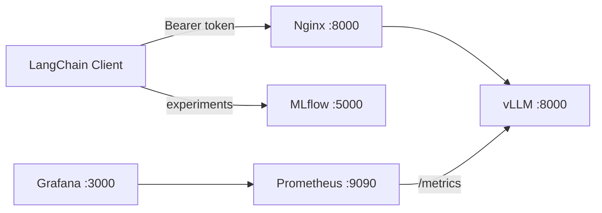

# LLMOps Stack

Production-ready GPU LLMOps stack for serving open-weight LLMs with Docker Compose. Deploys **vLLM** inference behind an authenticated **Nginx** proxy, with **Prometheus/Grafana** metrics and **MLflow** experiment tracking.

Optimized for a single **NVIDIA GPU** (e.g. RTX 3090).

## Overview

This project packages a complete inference pipeline:

- **Inference** — vLLM serves [Qwen3-4B-Instruct](https://huggingface.co/Qwen/Qwen3-4B-Instruct-2507) via an OpenAI-compatible API
- **Security** — Nginx reverse proxy enforces Bearer token authentication; vLLM is not exposed on the host
- **Monitoring** — Prometheus scrapes vLLM metrics; Grafana ships with a pre-built inference dashboard
- **Observability** — MLflow logs prompts, responses, and latency for quality tracking
- **Client** — LangChain test script validates the full stack end to end



## Project layout

```
LLM_Deployment_Stack/
├── docker-compose.yml          # Main orchestrator (GPU)
├── .env.example                # Environment variable template
├── config/
│   ├── nginx.conf              # Reverse proxy + Bearer auth
│   ├── prometheus.yml          # vLLM metrics scrape config
│   └── grafana/
│       ├── dashboards/
│       │   └── vllm-inference.json
│       └── provisioning/       # Auto-configured datasource + dashboards
├── client/
│   ├── pyproject.toml          # Python dependencies (uv)
│   ├── uv.lock                 # Locked dependency versions
│   └── test_stack.py           # LangChain + MLflow integration test
└── scripts/
    └── set-repo-token.sh       # Repo-scoped GitHub PAT setup (optional)
```

## Stack

| Service | Image | Host port | Role |
|---------|-------|-----------|------|
| **vLLM** | `vllm/vllm-openai:latest` | — (internal) | GPU inference engine |
| **Nginx** | `nginx:1.27-alpine` | `8000` | Auth proxy → vLLM |
| **Prometheus** | `prom/prometheus:v2.54.1` | `9090` | Metrics collection |
| **Grafana** | `grafana/grafana:11.2.0` | `3000` | Dashboards & visualization |
| **MLflow** | `ghcr.io/mlflow/mlflow:v2.17.0` | `5000` | Experiment tracking |

### vLLM configuration

| Setting | Value |
|---------|-------|
| Model | `Qwen/Qwen3-4B-Instruct-2507` |
| Served name | `qwen-4b-instruct` |
| Context window | 4096 tokens |
| GPU memory | 90% utilization |
| API | OpenAI-compatible (`/v1/chat/completions`) |

### Grafana dashboard metrics

- Time to First Token (TTFT) — p50 / p95 / p99
- End-to-end request latency
- Token throughput (generated vs prompt)
- GPU KV cache usage

## Prerequisites

- **Docker** and **Docker Compose** v2+
- **NVIDIA GPU** with drivers installed
- **[NVIDIA Container Toolkit](https://docs.nvidia.com/datacenter/cloud-native/container-toolkit/install-guide.html)** (`nvidia-docker`)
- **Hugging Face token** — required if the model is gated (`HF_TOKEN`)
- **uv** — for the Python client ([install guide](https://docs.astral.sh/uv/getting-started/installation/))

Verify GPU access:

```bash
docker run --rm --gpus all nvidia/cuda:12.0.0-base-ubuntu22.04 nvidia-smi
```

## Quick start

### 1. Configure environment

```bash
cp .env.example .env
```

Edit `.env` and set your Hugging Face token:

```bash
HF_TOKEN=hf_your_token_here
```

### 2. Start the stack

```bash
docker compose up -d
```

vLLM needs time to download and load the model. The health check allows up to **5 minutes** (`start_period: 300s`). Nginx, Prometheus, and Grafana start only after vLLM is healthy.

Watch startup progress:

```bash
docker compose logs -f vllm
```

### 3. Verify inference (curl)

All API requests must include the Bearer token:

```bash
curl http://localhost:8000/v1/models \
  -H "Authorization: Bearer ML expert rules"
```

Send a chat completion:

```bash
curl http://localhost:8000/v1/chat/completions \
  -H "Authorization: Bearer ML expert rules" \
  -H "Content-Type: application/json" \
  -d '{
    "model": "qwen-4b-instruct",
    "messages": [{"role": "user", "content": "Hello!"}],
    "max_tokens": 128
  }'
```

### 4. Run the test client

```bash
cd client
uv sync
uv run python test_stack.py
```

The client routes requests through Nginx, uses the Bearer token as the API key, and logs each prompt/response pair to MLflow.

## Service URLs

| UI | URL | Default credentials |
|----|-----|---------------------|
| Inference API | http://localhost:8000/v1 | Bearer `ML expert rules` |
| Grafana | http://localhost:3000 | `admin` / `admin` |
| Prometheus | http://localhost:9090 | — |
| MLflow | http://localhost:5000 | — |

## Environment variables

| Variable | Default | Description |
|----------|---------|-------------|
| `HF_TOKEN` | — | Hugging Face token for model download |
| `VLLM_MODEL` | `Qwen/Qwen3-4B-Instruct-2507` | Hugging Face model ID |
| `MLFLOW_TRACKING_URI` | `http://localhost:5000` | MLflow server URL |

Client-side (optional, in `.env` at project root):

| Variable | Default | Description |
|----------|---------|-------------|
| `NGINX_BASE_URL` | `http://localhost:8000/v1` | OpenAI-compatible endpoint |
| `BEARER_TOKEN` | `ML expert rules` | Nginx auth token |
| `VLLM_MODEL_NAME` | `qwen-4b-instruct` | Model name sent to the API |

## Security

- vLLM is **not** published on the host — only Nginx is reachable on port `8000`
- Requests without `Authorization: Bearer ML expert rules` receive `401 Unauthorized`
- Prometheus scrapes vLLM **directly** on the internal Docker network (bypasses Nginx auth)
- Change the default Grafana password after first login
- Never commit `.env` or tokens to version control

## Operations

**Stop the stack:**

```bash
docker compose down
```

**Stop and remove volumes** (clears model cache, metrics, MLflow data):

```bash
docker compose down -v
```

**View logs for a service:**

```bash
docker compose logs -f vllm
docker compose logs -f nginx
```

**Restart a single service:**

```bash
docker compose restart vllm
```

## Troubleshooting

| Symptom | Likely cause | Fix |
|---------|--------------|-----|
| vLLM stuck in `starting` | Model download in progress | Wait up to 5 min; check `docker compose logs vllm` |
| `401 Unauthorized` on API | Missing/wrong Bearer token | Use `Authorization: Bearer ML expert rules` |
| CUDA / GPU errors | NVIDIA toolkit not installed | Install [NVIDIA Container Toolkit](https://docs.nvidia.com/datacenter/cloud-native/container-toolkit/install-guide.html) |
| OOM on GPU | VRAM exhausted | Lower `--gpu-memory-utilization` or use a smaller model |
| Grafana shows no data | vLLM not yet serving traffic | Send a few requests, then refresh the dashboard |
| Client `Connection refused` | Stack not running | Run `docker compose up -d` and wait for vLLM health check |

## Architecture notes

- **Startup order:** vLLM → (healthy) → Nginx + Prometheus → Grafana
- **Model cache:** persisted in the `huggingface_cache` Docker volume across restarts
- **Health check:** vLLM `GET /health` every 30s, 50s timeout, 300s start period
- **Metrics scrape:** Prometheus polls vLLM `/metrics` every 5 seconds

## License

Model weights are subject to the [Qwen license](https://huggingface.co/Qwen/Qwen3-4B-Instruct-2507). Infrastructure configs in this repository are provided as-is for deployment reference.
