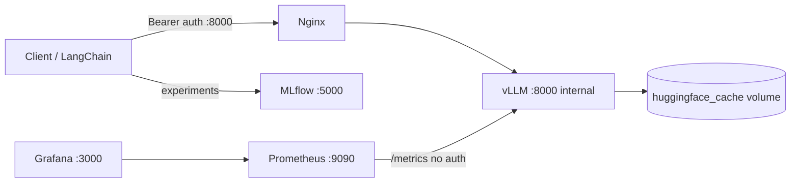

# LLMOps Stack Documentation

Guides for each service in the unified inference and monitoring stack.

## Architecture



## Quick start

| Runtime | Command |
|---------|---------|
| CPU | `docker compose -f docker-compose.yml -f docker-compose.cpu.yml up -d` |
| NVIDIA GPU | `docker compose -f docker-compose.yml -f docker-compose.gpu.yml up -d` |
| AMD ROCm | `docker compose -f docker-compose.yml -f docker-compose.rocm.yml up -d` |

Copy `.env.example` to `.env` before starting. Default model: **Qwen/Qwen2.5-0.5B** (cached in `huggingface_cache`).

Compose merges the base file with a runtime override (`-f` left → right). To inspect the result:

```bash
docker compose -f docker-compose.yml -f docker-compose.cpu.yml config
```

Auth on Nginx only applies to host traffic (`localhost:8000`). The vLLM healthcheck and Prometheus scrape reach vLLM directly and do not need a Bearer token — see [nginx.md](nginx.md) and [deployment.md](deployment.md).

For the difference between host `localhost` and the internal `llmops` Docker network, see [Localhost vs the internal Docker network](deployment.md#localhost-vs-the-internal-docker-network).

## Service guides

| Service | Doc | Host port | Role |
|---------|-----|-----------|------|
| Nginx | [nginx.md](nginx.md) | 8000 | Authenticated API gateway |
| Prometheus | [prometheus.md](prometheus.md) | 9090 | Metrics collection |
| Grafana | [grafana.md](grafana.md) | 3000 | Dashboards |
| Deployment | [deployment.md](deployment.md) | — | CPU / GPU / ROCm setup, networking, env vars |

## Other services

- **vLLM** — OpenAI-compatible inference engine (internal only, not published to host)
- **MLflow** — Experiment tracking at http://localhost:5000

## Verification

```bash
VLLM_RUNTIME=cpu ./scripts/verify-stack.sh
```

## Further reading

- Root [README.md](../README.md) — quick start and troubleshooting
- [vLLM metrics](https://docs.vllm.ai/en/latest/usage/metrics/) — upstream metric reference
