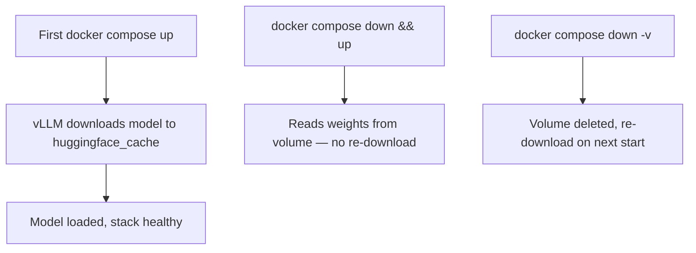

# Deployment Guide

How to run the LLMOps stack on CPU, NVIDIA GPU, or AMD ROCm hardware.

## Prerequisites (all runtimes)

- Docker Engine and Docker Compose v2+
- Copy environment file: `cp .env.example .env`

Default model: **Qwen/Qwen2.5-0.5B** — downloaded on first start into the `huggingface_cache` volume and reused on subsequent runs.

## Choose your runtime

| Runtime | Compose command | Hardware |
|---------|-----------------|----------|
| CPU | `docker compose -f docker-compose.yml -f docker-compose.cpu.yml up -d` | Any x86_64 machine |
| NVIDIA GPU | `docker compose -f docker-compose.yml -f docker-compose.gpu.yml up -d` | NVIDIA GPU + Container Toolkit |
| AMD ROCm | `docker compose -f docker-compose.yml -f docker-compose.rocm.yml up -d` | AMD GPU + amdgpu driver |

## How Compose override files work

The deploy command uses two `-f` files. Compose merges them left → right; later files override earlier ones for the same service.

| Part | Meaning |
|------|---------|
| `docker compose` | Docker Compose v2 CLI |
| `-f docker-compose.yml` | Base stack: shared services (vLLM shell, Nginx, Prometheus, Grafana, MLflow, network, volumes) |
| `-f docker-compose.cpu.yml` (or `.gpu.yml` / `.rocm.yml`) | Runtime override: image, devices, CPU/GPU/ROCm-specific vLLM flags |
| `up` | Create and start services |
| `-d` | Detached (run in the background) |

Example: with the CPU override, you get the full shared stack from the base file, with the `vllm` service swapped to the CPU image and resource limits.

### Inspect the merged Compose file

To see the fully resolved definition after overrides and env substitution:

```bash
docker compose -f docker-compose.yml -f docker-compose.cpu.yml config
```

Useful variants:

```bash
# Save to a file
docker compose -f docker-compose.yml -f docker-compose.cpu.yml config > merged.yml

# Validate only (no output if OK)
docker compose -f docker-compose.yml -f docker-compose.cpu.yml config --quiet
```

## Localhost vs the internal Docker network

`localhost` and the Compose network (`llmops`) are different places. The same hostname means different things depending on **where** the request runs.

### `localhost` / `127.0.0.1`

Means “this machine / this container only.” It never jumps to another container by itself.

| Where you run the request | What `localhost:8000` is |
|---------------------------|--------------------------|
| On your **host** (browser, PowerShell, curl) | Nginx (published as host port 8000) |
| **Inside** the vLLM container | vLLM itself (used by the healthcheck) |
| **Inside** the Prometheus container | Prometheus’s own loopback — **not** vLLM |

### Internal Docker network (`llmops`)

Compose creates a private virtual network named `llmops`. Containers on it resolve each other by **service name** (Docker DNS):

| Hostname | Resolves to |
|----------|-------------|
| `vllm` | vLLM container |
| `nginx` | Nginx container |
| `prometheus` | Prometheus container |
| `grafana` | Grafana container |
| `mlflow` | MLflow container |

Example: from Prometheus, `http://vllm:8000/metrics` reaches vLLM on that shared network — no host ports, no Nginx.

### How this stack uses both

```text
HOST (your PC)
  localhost:8000  →  Nginx (published port)
  localhost:9090  →  Prometheus UI
  localhost:3000  →  Grafana
  localhost:5000  →  MLflow

DOCKER NETWORK "llmops"
  nginx  ──proxy──►  vllm:8000
  prometheus ──────►  vllm:8000/metrics   (no auth)
  grafana ─────────►  prometheus:9090

INSIDE vllm CONTAINER
  127.0.0.1:8000/health  →  vLLM only (healthcheck)
```

**Rule of thumb:** use `localhost` from the host for published UIs and the API; use service names (`vllm`, `prometheus`) for container-to-container traffic on the internal network.

## Hugging Face token (`HF_TOKEN`)

You only set **one** value in `.env`:

```bash
HF_TOKEN=hf_your_token_here
```

Inside the vLLM container, Compose maps that same value to two environment variables:

| Env var in container | Why |
|----------------------|-----|
| `HF_TOKEN` | Common shorthand used by many HF / vLLM examples |
| `HUGGING_FACE_HUB_TOKEN` | Official Hugging Face Hub library name |

They are the same token, not two different secrets. Setting both avoids "token not found" if one code path only checks one name. Optional for public models like `Qwen/Qwen2.5-0.5B`; required for gated models.

## CPU deployment

### Requirements

- No GPU required
- Sufficient RAM (16 GB+ recommended for 0.5B model)
- Image: `public.ecr.aws/q9t5s3a7/vllm-cpu-release-repo:v0.20.1`

### Environment variables

| Variable | Default | Description |
|----------|---------|-------------|
| `VLLM_IMAGE` | CPU release image | vLLM CPU Docker image |
| `VLLM_MAX_MODEL_LEN` | 2048 | Context window |
| `VLLM_MEM_LIMIT` | 16g | Container memory cap |
| `VLLM_SHM_SIZE` | 4g | Shared memory |
| `VLLM_CPU_KVCACHE_SPACE` | 4 | KV cache space (GB) |

### Windows notes

- Use **Docker Desktop with WSL2** backend for best compatibility
- Model cache lives in the Docker volume — no Windows path configuration needed
- First start downloads ~1 GB; allow up to 5 minutes for health check

### Verify

```bash
VLLM_RUNTIME=cpu ./scripts/verify-stack.sh
```

## NVIDIA GPU deployment

### Requirements

- NVIDIA GPU with drivers installed
- [NVIDIA Container Toolkit](https://docs.nvidia.com/datacenter/cloud-native/container-toolkit/install-guide.html)

Verify GPU access:

```bash
docker run --rm --gpus all nvidia/cuda:12.0.0-base-ubuntu22.04 nvidia-smi
```

### Environment variables

| Variable | Default | Description |
|----------|---------|-------------|
| `VLLM_GPU_MEMORY_UTILIZATION` | 0.9 | Fraction of VRAM to use |
| `VLLM_MAX_MODEL_LEN` | 4096 | Context window |
| `HF_TOKEN` | — | Required for gated models |

### Image

`vllm/vllm-openai:latest` with `gpus: all`

## AMD ROCm deployment

### Requirements

- AMD GPU with amdgpu driver (ROCm 6.3+)
- `/dev/kfd` and `/dev/dri` device nodes on host
- Linux host (ROCm Docker is not supported on native Windows)

### Environment variables

| Variable | Default | Description |
|----------|---------|-------------|
| `VLLM_ROCM_USE_AITER` | 1 | Enable AITER optimizations |
| `VLLM_MAX_MODEL_LEN` | 4096 | Context window |

### Image

`vllm/vllm-openai-rocm:latest`

Device access is configured in `docker-compose.rocm.yml`:

```yaml
devices:
  - /dev/kfd
  - /dev/dri
group_add:
  - video
```

## Model cache lifecycle



| Action | Model cache |
|--------|-------------|
| `docker compose down` | **Preserved** |
| `docker compose down -v` | **Deleted** |
| Change `VLLM_MODEL` in `.env` | New model downloaded alongside existing cache |

## Changing the model

Edit `.env`:

```bash
VLLM_MODEL=meta-llama/Llama-3.2-1B-Instruct
VLLM_SERVED_MODEL_NAME=llama-3.2-1b
VLLM_MODEL_NAME=llama-3.2-1b   # for test client
```

Restart vLLM:

```bash
docker compose -f docker-compose.yml -f docker-compose.cpu.yml restart vllm
```

Prometheus picks up the new model label automatically via the config template.

## Air-gapped / bind-mount (advanced)

For environments without internet access, pre-download model weights and add a bind-mount in a local `docker-compose.override.yml`:

```yaml
services:
  vllm:
    volumes:
      - /host/path/to/model:/models/qwen:ro
    command:
      - --model
      - /models/qwen
```

## Service URLs

| Service | URL |
|---------|-----|
| Inference API | http://localhost:8000/v1 |
| Grafana | http://localhost:3000 |
| Prometheus | http://localhost:9090 |
| MLflow | http://localhost:5000 |

## Operations

```bash
# Stop (keeps volumes)
docker compose -f docker-compose.yml -f docker-compose.cpu.yml down

# Stop and wipe all data (model cache, metrics, MLflow)
docker compose -f docker-compose.yml -f docker-compose.cpu.yml down -v

# View logs
docker compose -f docker-compose.yml -f docker-compose.cpu.yml logs -f vllm
```

## Startup order

```
vLLM (healthy) → Nginx + Prometheus → Grafana
MLflow starts independently
```

vLLM health check allows up to **5 minutes** (`start_period: 300s`) for first-time model download.

### Why the healthcheck does not need Nginx auth

The healthcheck runs **inside** the vLLM container and calls `http://127.0.0.1:8000/health`. That hits vLLM on localhost in the same container — it never goes through Nginx.

```text
Host → Nginx (:8000) → vLLM     ← public API; Bearer token required
Docker healthcheck → 127.0.0.1:8000/health  ← no Nginx, no auth
Prometheus → vllm:8000/metrics  ← internal Docker network; no Nginx, no auth
```

Auth only applies to traffic that enters via the Nginx proxy on the host. See [nginx.md](nginx.md) for the full auth boundary. For host `localhost` vs the `llmops` network, see [Localhost vs the internal Docker network](#localhost-vs-the-internal-docker-network).

## Further reading

- [nginx.md](nginx.md) — API authentication
- [prometheus.md](prometheus.md) — metrics troubleshooting
- [grafana.md](grafana.md) — dashboard panels
