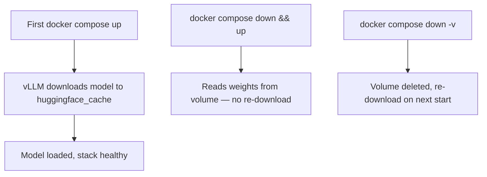

# Deployment Guide

How to run the LLMOps stack on CPU, NVIDIA GPU, or AMD ROCm hardware.

## Prerequisites (all runtimes)

- Docker Engine and Docker Compose v2+
- Copy environment file: `cp .env.example .env`

Default model: **Qwen/Qwen2.5-0.5B** — downloaded on first start into the `huggingface_cache` volume and reused on subsequent runs.

## Choose your runtime

| Runtime | Compose command | Hardware |
|---------|-----------------|----------|
| CPU | `docker compose -f docker-compose.yml -f docker-compose.cpu.yml up -d` | Any x86_64 machine |
| NVIDIA GPU | `docker compose -f docker-compose.yml -f docker-compose.gpu.yml up -d` | NVIDIA GPU + Container Toolkit |
| AMD ROCm | `docker compose -f docker-compose.yml -f docker-compose.rocm.yml up -d` | AMD GPU + amdgpu driver |

## CPU deployment

### Requirements

- No GPU required
- Sufficient RAM (16 GB+ recommended for 0.5B model)
- Image: `public.ecr.aws/q9t5s3a7/vllm-cpu-release-repo:v0.20.1`

### Environment variables

| Variable | Default | Description |
|----------|---------|-------------|
| `VLLM_IMAGE` | CPU release image | vLLM CPU Docker image |
| `VLLM_MAX_MODEL_LEN` | 2048 | Context window |
| `VLLM_MEM_LIMIT` | 16g | Container memory cap |
| `VLLM_SHM_SIZE` | 4g | Shared memory |
| `VLLM_CPU_KVCACHE_SPACE` | 4 | KV cache space (GB) |

### Windows notes

- Use **Docker Desktop with WSL2** backend for best compatibility
- Model cache lives in the Docker volume — no Windows path configuration needed
- First start downloads ~1 GB; allow up to 5 minutes for health check

### Verify

```bash
VLLM_RUNTIME=cpu ./scripts/verify-stack.sh
```

## NVIDIA GPU deployment

### Requirements

- NVIDIA GPU with drivers installed
- [NVIDIA Container Toolkit](https://docs.nvidia.com/datacenter/cloud-native/container-toolkit/install-guide.html)

Verify GPU access:

```bash
docker run --rm --gpus all nvidia/cuda:12.0.0-base-ubuntu22.04 nvidia-smi
```

### Environment variables

| Variable | Default | Description |
|----------|---------|-------------|
| `VLLM_GPU_MEMORY_UTILIZATION` | 0.9 | Fraction of VRAM to use |
| `VLLM_MAX_MODEL_LEN` | 4096 | Context window |
| `HF_TOKEN` | — | Required for gated models |

### Image

`vllm/vllm-openai:latest` with `gpus: all`

## AMD ROCm deployment

### Requirements

- AMD GPU with amdgpu driver (ROCm 6.3+)
- `/dev/kfd` and `/dev/dri` device nodes on host
- Linux host (ROCm Docker is not supported on native Windows)

### Environment variables

| Variable | Default | Description |
|----------|---------|-------------|
| `VLLM_ROCM_USE_AITER` | 1 | Enable AITER optimizations |
| `VLLM_MAX_MODEL_LEN` | 4096 | Context window |

### Image

`vllm/vllm-openai-rocm:latest`

Device access is configured in `docker-compose.rocm.yml`:

```yaml
devices:
  - /dev/kfd
  - /dev/dri
group_add:
  - video
```

## Model cache lifecycle



| Action | Model cache |
|--------|-------------|
| `docker compose down` | **Preserved** |
| `docker compose down -v` | **Deleted** |
| Change `VLLM_MODEL` in `.env` | New model downloaded alongside existing cache |

## Changing the model

Edit `.env`:

```bash
VLLM_MODEL=meta-llama/Llama-3.2-1B-Instruct
VLLM_SERVED_MODEL_NAME=llama-3.2-1b
VLLM_MODEL_NAME=llama-3.2-1b   # for test client
```

Restart vLLM:

```bash
docker compose -f docker-compose.yml -f docker-compose.cpu.yml restart vllm
```

Prometheus picks up the new model label automatically via the config template.

## Air-gapped / bind-mount (advanced)

For environments without internet access, pre-download model weights and add a bind-mount in a local `docker-compose.override.yml`:

```yaml
services:
  vllm:
    volumes:
      - /host/path/to/model:/models/qwen:ro
    command:
      - --model
      - /models/qwen
```

## Service URLs

| Service | URL |
|---------|-----|
| Inference API | http://localhost:8000/v1 |
| Grafana | http://localhost:3000 |
| Prometheus | http://localhost:9090 |
| MLflow | http://localhost:5000 |

## Operations

```bash
# Stop (keeps volumes)
docker compose -f docker-compose.yml -f docker-compose.cpu.yml down

# Stop and wipe all data (model cache, metrics, MLflow)
docker compose -f docker-compose.yml -f docker-compose.cpu.yml down -v

# View logs
docker compose -f docker-compose.yml -f docker-compose.cpu.yml logs -f vllm
```

## Startup order

```
vLLM (healthy) → Nginx + Prometheus → Grafana
MLflow starts independently
```

vLLM health check allows up to **5 minutes** (`start_period: 300s`) for first-time model download.

## Further reading

- [nginx.md](nginx.md) — API authentication
- [prometheus.md](prometheus.md) — metrics troubleshooting
- [grafana.md](grafana.md) — dashboard panels
