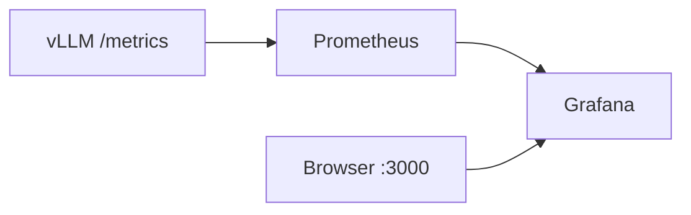

# Grafana Dashboards

Grafana visualizes Prometheus metrics with a pre-provisioned vLLM inference dashboard.

## Role in the stack

| Responsibility | Detail |
|----------------|--------|
| Query | Pull metrics from Prometheus (`http://prometheus:9090`) |
| Visualize | Pre-built dashboard for latency, throughput, and cache usage |
| Persist | Store user preferences in `grafana_data` volume |

## Access

| Property | Value |
|----------|-------|
| URL | http://localhost:3000 |
| Default login | `admin` / `admin` |
| Theme | Dark (configured via `GF_USERS_DEFAULT_THEME`) |

Change the admin password on first login.

## Auto-provisioning

Grafana starts fully configured — no manual datasource or dashboard import needed.

### Datasource

File: [`config/grafana/provisioning/datasources/prometheus.yml`](../config/grafana/provisioning/datasources/prometheus.yml)

```yaml
datasources:
  - name: Prometheus
    uid: prometheus
    type: prometheus
    url: http://prometheus:9090
    isDefault: true
```

Grafana connects to Prometheus over the internal `llmops` network using Docker DNS.

### Dashboard

File: [`config/grafana/provisioning/dashboards/dashboard.yml`](../config/grafana/provisioning/dashboards/dashboard.yml)

Loads JSON dashboards from `config/grafana/dashboards/` into the **LLMOps** folder.

Pre-built dashboard: [`config/grafana/dashboards/vllm-inference.json`](../config/grafana/dashboards/vllm-inference.json)

## Dashboard panels

| Panel | PromQL (summary) | What it shows |
|-------|------------------|---------------|
| Time to First Token | `histogram_quantile(..., vllm:time_to_first_token_seconds_bucket)` | p50 / p95 / p99 TTFT |
| Request Latency | `histogram_quantile(..., vllm:e2e_request_latency_seconds_bucket)` | End-to-end p50 / p95 / p99 |
| Token Throughput | `rate(vllm:generation_tokens_total)`, `rate(vllm:prompt_tokens_total)` | Tokens per second |
| Requests Running | `vllm:num_requests_running` | Current active requests |
| Successful Requests | `increase(vllm:request_success_total[5m])` | Success count (5 min window) |
| KV Cache Usage | `vllm:kv_cache_usage_perc` | Cache utilization (CPU + GPU) |

Dashboard auto-refreshes every **5 seconds**.

## Data flow



Grafana never talks to vLLM directly. All metrics flow through Prometheus.

## "No data" is often normal

Grafana panels may be empty even when everything is healthy:

1. **No inference traffic yet** — histogram and counter metrics only populate after requests
2. **Prometheus target just came UP** — wait one scrape interval (15s)
3. **Time range too narrow** — dashboard defaults to "Last 15 minutes"

### Generate data

```bash
curl http://localhost:8000/v1/chat/completions \
  -H "Authorization: Bearer ML expert rules" \
  -H "Content-Type: application/json" \
  -d '{
    "model": "qwen-0.5b",
    "messages": [{"role": "user", "content": "Hello!"}],
    "max_tokens": 64
  }'
```

Or run the test client:

```bash
cd client && uv run python test_stack.py
```

Refresh the Grafana dashboard after a few requests.

## Troubleshooting

| Symptom | Likely cause | Fix |
|---------|--------------|-----|
| All panels empty | No traffic yet | Send inference requests |
| "Datasource not found" | Provisioning failed | Check `docker compose logs grafana` |
| Stale data | Prometheus target DOWN | See [prometheus.md](prometheus.md) |
| Login fails | Wrong credentials | Default is `admin` / `admin` |

## Customization

| Task | How |
|------|-----|
| Edit dashboard | Grafana UI → Dashboards → LLMOps → vLLM Inference → Save |
| Add panels | Use existing `vllm:*` metrics from [prometheus.md](prometheus.md) |
| Export JSON | Dashboard settings → JSON Model → save to `config/grafana/dashboards/` |

## Container details

| Property | Value |
|----------|-------|
| Image | `grafana/grafana:11.2.0` |
| Container name | `grafana` |
| Host port | 3000 |
| Depends on | Prometheus |
| Volume | `grafana_data:/var/lib/grafana` |

## Further reading

- [Prometheus guide](prometheus.md) — scrape config and metric names
- [Grafana Prometheus datasource docs](https://grafana.com/docs/grafana/latest/datasources/prometheus/)
