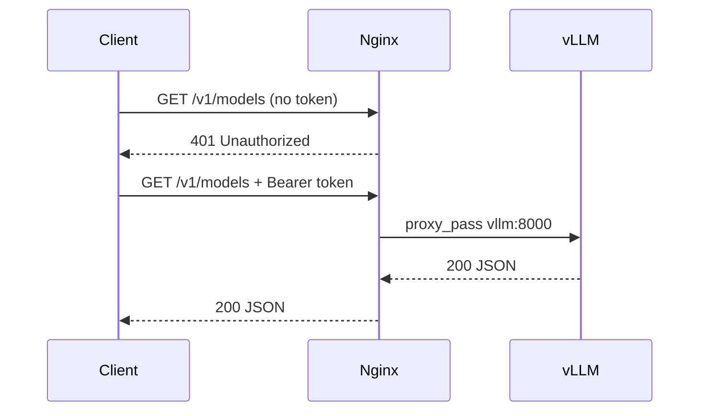

# Nginx Reverse Proxy

Nginx is the **only public entrypoint** for the inference API. vLLM listens on port 8000 inside the Docker network but is not published to the host.

## Role in the stack

| Responsibility | Detail |
|----------------|--------|
| Security gate | Bearer token authentication on every API request |
| Reverse proxy | Forwards authorized traffic to `vllm:8000` |
| Streaming | Disables buffering for SSE/token streaming from vLLM |

Configuration file: [`config/nginx.conf`](../config/nginx.conf)

## Request flow



## Bearer token authentication

Nginx uses an `map` directive to validate the `Authorization` header:

```nginx
map $http_authorization $auth_ok {
    default 0;
    "Bearer ML expert rules" 1;
}
```

Only the exact value `Bearer ML expert rules` is accepted. Any other header (or a missing header) returns:

```json
{"error":"Unauthorized","message":"Valid Bearer token required"}
```

### Changing the token

1. Edit the `map` block in `config/nginx.conf`
2. Set the same value in `.env` as `BEARER_TOKEN` for the test client
3. Restart Nginx: `docker compose restart nginx`

## Upstream configuration

```nginx
upstream vllm_backend {
    server vllm:8000;
    keepalive 32;
}
```

Docker DNS resolves `vllm` to the vLLM container on the `llmops` network.

## Streaming / SSE settings

vLLM streams tokens over long-lived HTTP connections. Nginx is configured for this:

| Setting | Value | Why |
|---------|-------|-----|
| `proxy_buffering` | `off` | Tokens arrive incrementally |
| `proxy_cache` | `off` | Responses must not be cached |
| `proxy_read_timeout` | `300s` | Long generations won't time out |
| `chunked_transfer_encoding` | `on` | Required for streaming bodies |

## What bypasses Nginx auth (and why)

Nginx auth applies only to traffic that enters through the host proxy (`localhost:8000`). Several paths talk to vLLM **without** going through Nginx:

| Caller | URL | Path |
|--------|-----|------|
| Docker healthcheck | `http://127.0.0.1:8000/health` | Runs **inside** the vLLM container (localhost) |
| Prometheus | `http://vllm:8000/metrics` | Internal `llmops` Docker network |
| Host / clients | `http://localhost:8000/...` | Goes through Nginx → **Bearer required** |

```text
Host → Nginx (:8000) → vLLM     ← public API; Bearer token required
Docker healthcheck → 127.0.0.1:8000/health  ← no Nginx, no auth
Prometheus → vllm:8000/metrics               ← no Nginx, no auth
```

`localhost` on the host is not the same as `vllm` on the Docker network. Full explanation: [Localhost vs the internal Docker network](deployment.md#localhost-vs-the-internal-docker-network).

### Why metrics do NOT go through Nginx

Prometheus scrapes vLLM **directly** at `http://vllm:8000/metrics` on the internal Docker network. This is intentional:

- Nginx requires Bearer auth on **all** paths, including `/metrics`
- A request to `http://localhost:8000/metrics` from your browser hits Nginx and returns **401**
- Prometheus does not send auth headers, so routing metrics through Nginx would break scraping

To check metrics, use the Prometheus UI at http://localhost:9090/targets or run `./scripts/verify-stack.sh`.

## Host access

| URL | Auth required |
|-----|---------------|
| `http://localhost:8000/v1/models` | Yes (Bearer token) |
| `http://localhost:8000/v1/chat/completions` | Yes |
| `http://localhost:8000/metrics` | Yes (returns 401 — use Prometheus instead) |

## Troubleshooting

| Symptom | Cause | Fix |
|---------|-------|-----|
| `401 Unauthorized` | Missing or wrong Bearer token | Add `Authorization: Bearer ML expert rules` |
| `502 Bad Gateway` | vLLM not healthy or not running | Check `docker compose logs vllm` |
| Connection refused on :8000 | Nginx not started | Wait for vLLM health check; Nginx starts after vLLM is healthy |

## Container details

| Property | Value |
|----------|-------|
| Image | `nginx:1.27-alpine` |
| Container name | `nginx-proxy` |
| Host port | `${VLLM_PORT:-8000}` → container port 80 |
| Depends on | vLLM (healthy) |
