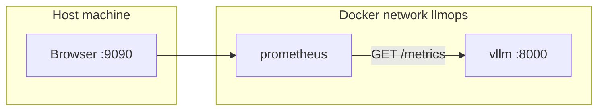

# Prometheus Metrics Collection

Prometheus polls vLLM's built-in `/metrics` endpoint and stores time-series data for Grafana.

## Role in the stack

| Responsibility | Detail |
|----------------|--------|
| Scrape | Poll `vllm:8000/metrics` every 5 seconds |
| Store | Persist metrics in the `prometheus_data` Docker volume |
| Serve | Expose query API at http://localhost:9090 |

Configuration template: [`config/prometheus.yml.template`](../config/prometheus.yml.template)

At startup, the Prometheus container renders the template with your `VLLM_SERVED_MODEL_NAME` label.

## Scrape configuration

```yaml
scrape_configs:
  - job_name: vllm
    scrape_interval: 5s
    scrape_timeout: 10s
    metrics_path: /metrics
    static_configs:
      - targets:
          - vllm:8000
        labels:
          service: vllm-inference
          model: <your served model name>
```

| Setting | Value | Notes |
|---------|-------|-------|
| Target | `vllm:8000` | Docker service name, **not** `localhost` |
| Path | `/metrics` | Enabled by default in vLLM OpenAI server |
| Timeout | `10s` | Increased from 4s to avoid false DOWN during load |
| Auth | None | Direct internal network access |

## Network topology



**Important:** `vllm` DNS only resolves inside the `llmops` network. Prometheus must run as part of the compose stack (or on the same network) to reach the target.

vLLM has **no published host port**. You cannot scrape `localhost:8000/metrics` — that address maps to Nginx, which returns 401.

## Startup dependency

Prometheus waits for vLLM to pass its health check before starting:

```yaml
depends_on:
  vllm:
    condition: service_healthy
```

If vLLM stays unhealthy (model download, bad health probe, OOM), the Prometheus container will not start. Check vLLM first:

```bash
docker compose -f docker-compose.yml -f docker-compose.cpu.yml ps vllm
docker compose -f docker-compose.yml -f docker-compose.cpu.yml logs vllm
```

## Key vLLM metrics

| Metric | Type | Description |
|--------|------|-------------|
| `vllm:num_requests_running` | Gauge | Active inference requests |
| `vllm:time_to_first_token_seconds_bucket` | Histogram | TTFT distribution |
| `vllm:e2e_request_latency_seconds_bucket` | Histogram | End-to-end latency |
| `vllm:generation_tokens_total` | Counter | Generated tokens |
| `vllm:prompt_tokens_total` | Counter | Prompt tokens processed |
| `vllm:kv_cache_usage_perc` | Gauge | KV cache utilization |
| `vllm:request_success_total` | Counter | Successful requests |

Metrics populate **after inference traffic**. A healthy target with zero request metrics is normal before the first API call.

## Verification

### Automated

```bash
VLLM_RUNTIME=cpu ./scripts/verify-stack.sh
```

### Manual

1. Open http://localhost:9090/targets — the `vllm` job should show **UP**
2. From inside the Prometheus container:

```bash
docker exec prometheus wget -qO- http://vllm:8000/metrics | head -20
```

3. Query in Prometheus UI: `vllm:num_requests_running`

## Troubleshooting

| Symptom | Likely cause | Fix |
|---------|--------------|-----|
| Prometheus container not running | vLLM unhealthy | Fix vLLM health; check logs |
| Target DOWN, "connection refused" | vLLM not listening | Wait for model load (up to 5 min) |
| Target DOWN, "no such host" | Prometheus outside compose network | Run Prometheus via compose |
| `401` at `localhost:8000/metrics` | Hitting Nginx, not vLLM | Use Prometheus UI or `verify-stack.sh` |
| Target UP, no metric values | No inference traffic yet | Send a chat completion request |
| Intermittent DOWN | Scrape timeout during heavy load | Already set to 10s; check vLLM load |

## Data persistence

| Command | Effect on metrics |
|---------|-------------------|
| `docker compose down` | Metrics preserved in `prometheus_data` volume |
| `docker compose down -v` | **Deletes** all stored metrics |

## Container details

| Property | Value |
|----------|-------|
| Image | `prom/prometheus:v2.54.1` |
| Container name | `prometheus` |
| Host port | 9090 |
| Volume | `prometheus_data:/prometheus` |

## Further reading

- [Grafana guide](grafana.md) — visualizing these metrics
- [vLLM production metrics](https://docs.vllm.ai/en/latest/usage/metrics/)
